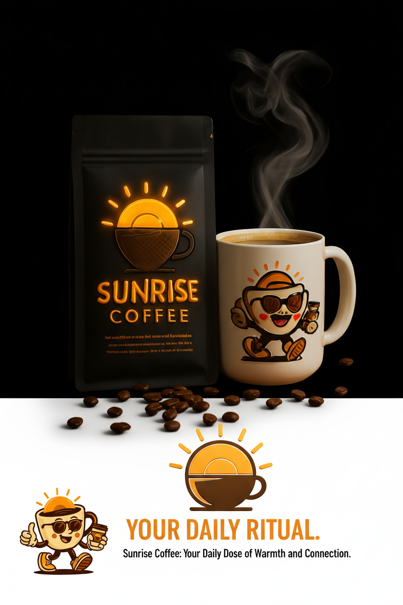
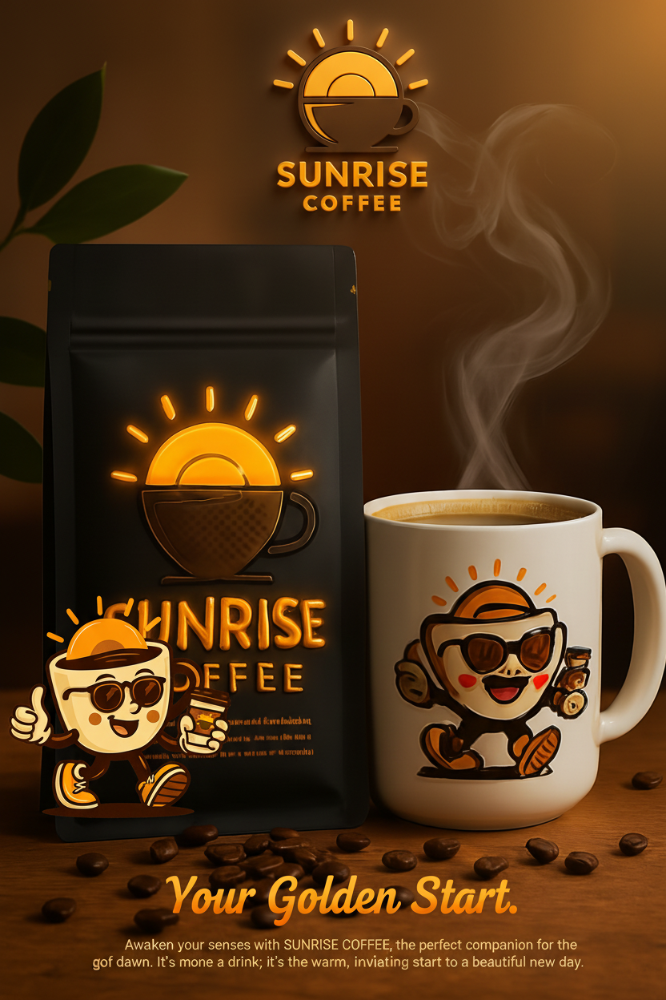
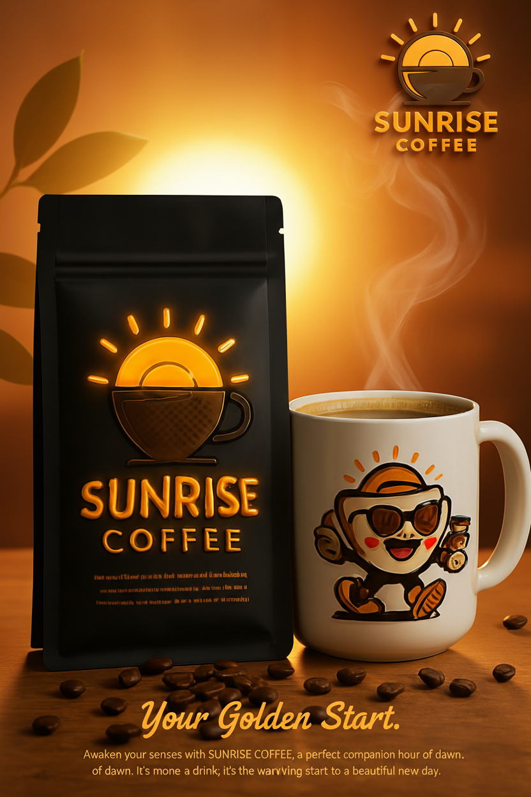

# AI Ad Factory (Brand-Bot)

An AI-powered creative engine that transforms one product photo and a brand guide into a complete, multi-platform ad campaign in seconds. This application leverages the Google Gemini API to generate a wide array of marketing assets, including images and videos, tailored to your specific brand identity.

## ✨ Features

- **Holistic Campaign Generation**: Automatically create a diverse set of ad creatives from a single set of inputs, ensuring brand consistency across all assets.
- **Multi-Platform Support**: Generate assets tailored for various ad placements, including:
  - X (formerly Twitter)
  - Instagram Story
  - TikTok Poster
  - LinkedIn Banner
  - Billboard / Out-of-Home (OOH)
  - Promotional Videos
- **AI-Powered Creative Suite**:
  - **Logo Generation**: Instantly create modern, clean logo variations from just a brand name.
  - **Mascot Creation**: Get unique, AI-generated mascot ideas based on your brand's personality and product.
  - **Intelligent Image Editing**:
    - **Background Removal**: Seamlessly remove the background from your product photos for a clean, professional look.
    - **Product Stylization**: Reimagine your product photo with a new, brand-aligned background and integrated logo.
  - **Copywriting Assistance**: Overcome creative block with AI-generated suggestions for campaign descriptions and taglines.
- **Deep Creative Control**:
  - **Visual Presets**: Choose from predefined styles like 'Minimal Luxe' or define your own 'Custom' aesthetic.
  - **A/B Testing**: Generate two distinct visual variations for image ads to test campaign effectiveness.
  - **Asset Placement Guidance**: Provide specific instructions on where to place your logo, tagline, and mascot.
  - **Seasonal Overlays**: Easily add a seasonal touch to your campaigns (e.g., "Summer Sale," "Holiday Special").
- **Advanced Video Generation**:
  - Create short, engaging promotional videos using the `veo-2.0-generate-001` model.
  - Control aspect ratio (16:9, 9:16, 1:1) to fit any platform.
  - Use a custom prompt for fine-grained control over the video's scene and narrative.
- **Enhanced User Experience**:
  - **Dark/Light Mode**: Switch between themes for visual comfort.
  - **State History**: Freely experiment with settings using Undo/Redo functionality.
  - **Interactive Viewer**: Click any creative to open a full-screen modal with a direct download link.
  - **Intuitive UI**: A clean, responsive interface that guides you through the campaign creation process.

## 📸 Screenshots

| Instagram Story Ad                                  | TikTok Poster Ad                                |
| --------------------------------------------------- | ----------------------------------------------- |
|    |    |

| LinkedIn Banner Ad                                  | Billboard/OOH Ad                                |
| --------------------------------------------------- | ----------------------------------------------- |
|    |    |

## 🎥 Live Demo / Video Walkthrough

See the AI Ad Factory in action! This video walkthrough demonstrates the process from input to a fully generated campaign:

**[➡️ Watch the Demo Video](./docs/demo.mp4)**

*(Note: To view the demo, you must first replace the placeholder `docs/demo.mp4` with your own screen recording of the application.)*

## 🚀 Getting Started

Creating a campaign is a simple, step-by-step process:

1.  **Define Your Brand**: In "1. Brand Assets," provide your brand name, upload a logo (or generate one!), and describe your brand's colors, font style, and tone. You can even generate a mascot!
2.  **Detail Your Campaign**: In "2. Campaign Details," upload your core product photo. Use the built-in tools to remove its background or stylize it. Then, describe your product and write a tagline (or let the AI suggest some).
3.  **Select Platforms**: Choose the ad formats you need. Select multiple platforms to generate a complete campaign set.
4.  **Customize & Direct**: Fine-tune the visual style with presets, add a seasonal theme, and optionally provide placement instructions for your logo and tagline in "3. Creative Direction."
5.  **Generate!** Click the **🚀 Generate Campaign** button and watch as the AI builds your ad set in real-time.

## ⚙️ Tech Stack

- **Frontend**: [React](https://reactjs.org/) with [TypeScript](https://www.typescriptlang.org/)
- **AI Model**: [Google Gemini API](https://ai.google.dev/) (`@google/genai`)
  - `gemini-2.5-flash`: For text and JSON-based generation (suggestions).
  - `gemini-2.5-flash-image-preview`: For advanced image editing and core ad creative generation.
  - `imagen-4.0-generate-001`: For generating new images from text (logos, mascots).
  - `veo-2.0-generate-001`: For generating high-quality video content.
- **Styling**: [Tailwind CSS](https://tailwindcss.com/)
- **Module Loading**: ES Modules via `importmap` (no local `node_modules` needed).

## 🛠️ Setup and Running

This project is designed to be run in an environment where the Google Gemini API key is securely managed as an environment variable.

1.  **API Key**:
    - The application requires a Google Gemini API key to function.
    - It is configured to read the key from `process.env.API_KEY`.
    - You must set this environment variable in your development environment (e.g., via a `.env` file if using a local server, or as a secret in a cloud environment).

2.  **Installation**:
    - No `npm install` is required for dependencies, as they are loaded via an `importmap` from a CDN.

3.  **Running**:
    - Serve the `index.html` file using any static file server.
    - Open the provided URL in your browser. The application will start immediately.

## 🤖 Technical Overview

1.  **Input**: The user provides brand assets (name, logo, colors, etc.) and campaign details (product photo, description, target platforms) through the sidebar UI (`ControlsSidebar.tsx`).
2.  **AI Services**: When the "Generate Campaign" button is clicked, the application calls functions within `services/geminiService.ts`.
3.  **Prompt Engineering**: The service dynamically constructs detailed, multi-modal prompts for each selected platform. It combines the user's text inputs and image files (converted to base64) into structured requests for the Gemini API.
4.  **API Calls**: The service calls the appropriate Gemini model for each task (e.g., `gemini-2.5-flash-image-preview` for images, `veo-2.0-generate-001` for video). Video generation involves an asynchronous polling mechanism to check for completion, providing progress updates to the UI.
5.  **Response Handling**: The generated images (as base64 data URLs) and videos (as blob URLs fetched from a temporary URI) are returned to the main `App.tsx` component.
6.  **Display**: The `ResultsDisplay.tsx` component renders the final creatives in a responsive grid, allowing the user to view and download their new ad campaign assets.